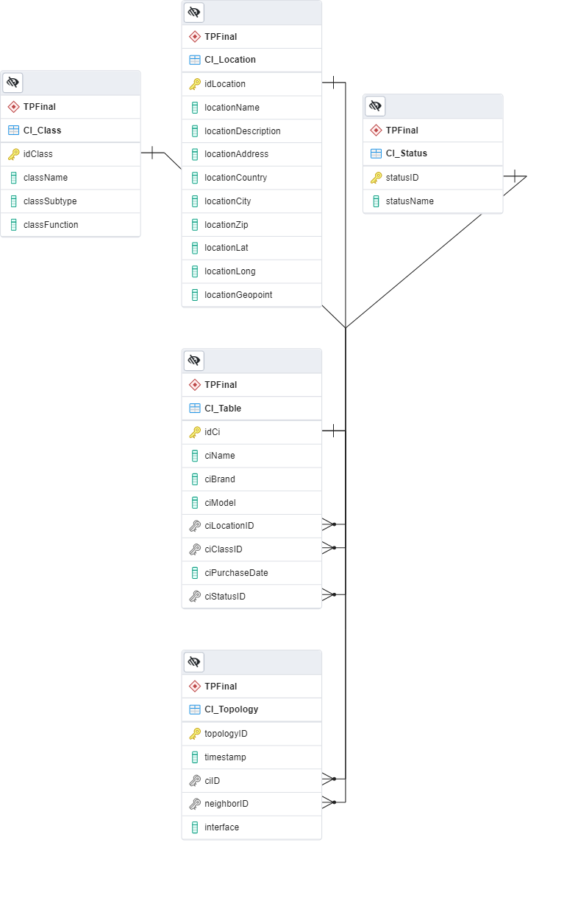
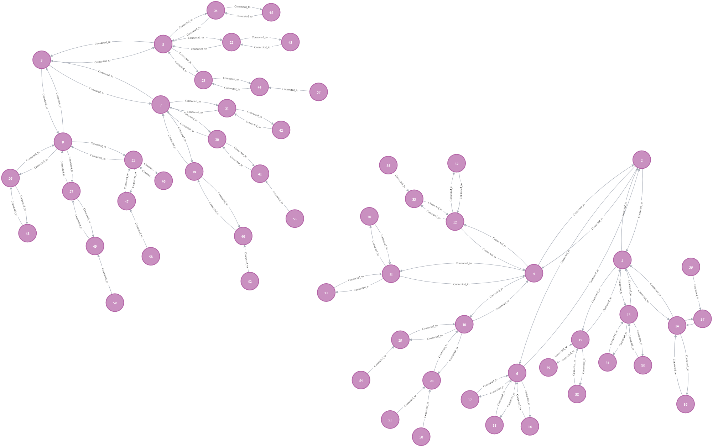

# CEIoT - Arquitectura de Datos - Trabajo Final

## Objetivo

Desarrollar el modelo e implementación de un aplicativo para visualizar una topología de red a nivel de capa 1/2 

Realizar el diseño lógico e implementación de una CMDB* a escala para dispositivos de redes bajo un modelo relacional. La CMDB Deberá constar de datos básicos para describir los dispositivos (Marca, Modelo, Función, etc.) y deberá incluir información de protocolos de descubrimiento de capa de enlace (CDP/LLDP) 

Realizar el diseño de una base de datos de grafos para almacenar las relaciones de los nodos como así también algunas propiedades básicas para su filtrado.

Realizar un aplicativo simple (o visualización a través de la base de datos) de las capacidades de filtrado y reporte de la topología.

*CMDB: Base de datos de inventario y administración de configuraciones de dispositivos 

## Consideraciones

Por no contar con un laboratorio real, tanto los dispositivos como la topología serán generados manualmente (o por script de generación)

El proceso de carga en la BD de grafos no será en tiempo real (batch y por frecuencia fija)

## Descripcion detallada

El LLDP (Link Layer Discovery Protocol) es un protocolo de descubrimiento de vecinos de capa 2 (enlace). El protocolo permite compartir informacion del dispositivo a sus vecinos directamente conectados 

Existen versiones proprietarias del protocolo, bajo diversas marcas (CDP-Cisco, NDP-Nortel, etc.), sin embargo todas proveen una funcionalidad similar, siendo LLDP la que permite estandarizar topologias de redes cuando exista diversidad de proveedores de equipos.

El poder conocer la topologia de interconexion de dispositivos permite identificar fallas de cableado, o dependencia entre dispositivos de red y prestadores de servicios, para asegurar la redundancia necesaria a nivel de red para sistemas criticos

Este mismo concepto de topologia, se puede aplicar en capas superiores para entender dependencia de servicios. El poder contar con ambas representaciones, permite evaluar impactos de fallas de capa fisica sobre la capa de aplicaciones

## Implementacion

### Modelo DER y Base de Datos Relacional

 La Base de datos elegida, sera la sugerida por la materia: PostgreSQL 

El modelo contará con una tabla de equipos, para control de inventario de dispositivos, una tabla de ubicaciones, para indicar el lugar de instalación, y finalmente sendas tablas de Estado y Clase, para indicar la condición del dispositivo, como así también su uso/función respectivamente. 

La información de conectividad entre equipos será almacenada en una tabla de topología, que incluya la interfaz de red usada en esa conexión.

La topología será cargada en forma manual, simulando una estructura de árbol.

Un script de Python ejecutara la sentencia SQL para extraer la información, y guardara el resultado en un archivo en formato Json

<figure>
    
    <figcaption>Esquema del modelo DER para la solucion propuesta</figcaption>
</figure>

[Script SQL utilzado para la creacion de las tablas](./CI_DB_Creation.sql)

### Base de Datos de Grafos

La base de datos a utilizar será Neo4j Community Edition, por ser de código abierto (Open Source), y por la amplia documentación existente. 

La carga de datos sera por script en Python, que cargara en modo “bulk” por lectura del archivo extraído anteriormente. 

La siguiente figura demuestra el resultado de la carga de la informacion, y la visualizacion de la misma provista por la misma base de datos 

<figure>
    
    <figcaption>Representacion en Neo4j de la relacion de conexiones entre dispositivos para el ejercicio</figcaption>
</figure>

### Aplicacion de carga, lectura y transporte de datos

La aplicacion utlizada para la carga de informacion, como para la extraccion de la base de datos relacional y el transporte a la base de grafos fue desarrollada en Python.

<figure>
    
    <figcaption>Representacion de ejecucion de aplicacion Python para carga, transformacion y subida de datos entre BDs.</figcaption>
</figure>

